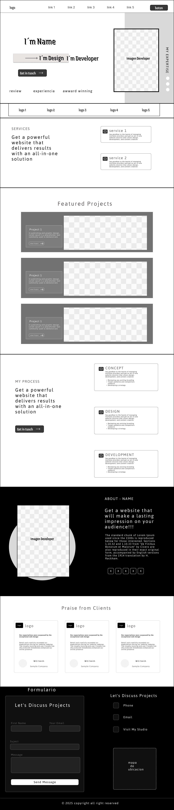

## 🎨 Wireframe - Portafolio Personal

Este wireframe representa la estructura visual de un portafolio web profesional, diseñado para presentar la marca personal, servicios, proyectos, y medios de contacto de un desarrollador o diseñador. Fue creado con el objetivo de servir como base estructural para construir la versión final usando tecnologías como **Astro**, **Tailwind CSS**, y **JavaScript**.

---

### 🧱 Estructura del Wireframe

#### 1. Header

- Logo personal.
- Navegación principal (links a secciones clave).
- Botón destacado (ej. "Contact" o "Hire Me").

#### 2. Hero Section

- Nombre y profesión destacada.
- Imagen del autor.
- Botón de llamado a la acción.
- Palabras clave como `experiencia`, `reviews`, `premios`.

#### 3. Navegación secundaria

- Íconos o nombres de herramientas / clientes importantes.

#### 4. Servicios

- Títulos de servicios con descripciones y beneficios.
- Estilo de tarjetas responsivas.

#### 5. Proyectos destacados

- Lista de proyectos con imágenes, descripciones y botones de detalle.

#### 6. Proceso de trabajo

- Fases: Concepto, Diseño y Desarrollo.
- Íconos y listas resumidas.

#### 7. Sección "Sobre mí"

- Imagen circular.
- Descripción corta y potente.
- Enlaces a redes sociales.

#### 8. Reseñas de clientes

- Opiniones de clientes anteriores con nombres y logos.

#### 9. Formulario de contacto

- Campos: Nombre, Email, Asunto, Mensaje.
- Opciones adicionales de contacto (teléfono, email, ubicación).

#### 10. Footer

- Derechos de autor.

---

### 🧾 Notas

- Este wireframe puede ser personalizado según necesidades del desarrollador o tipo de contenido.
- Ideal para usarse como guía en la fase de diseño UI/UX (por ejemplo, en Figma).
- Preparado para implementarse con enfoque mobile-first y responsive design.

---

  

---
